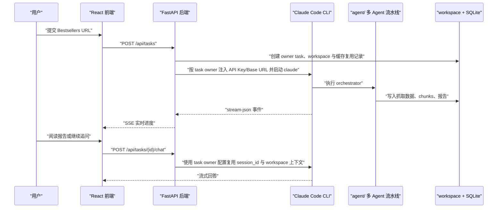

<div align="center">

# Amazon Bestsellers Summary App

*面向 Amazon Bestsellers 类目的 Agent 产品工作台：从类目 URL 到市场报告、实时进度和连续追问。*

[](https://code.claude.com/)
[](https://fastapi.tiangolo.com/)
[](https://react.dev/)
[](https://www.docker.com/)
[](LICENSE)

> **Agent Workspace** | **Amazon Bestsellers** | **Realtime SSE** | **Claude Code** | **Apache-2.0**

</div>

---

<div align="center">

**Language / 语言**

[**简体中文**](README.md) | [English](README_en.md)

</div>

---

<div align="center">

[项目简介](#项目简介) · [核心能力](#核心能力) · [项目架构](#项目架构) · [运行流程](#运行流程) · [部署方式](#部署方式) · [致谢](#致谢)

</div>

---

## 项目简介

**Amazon Bestsellers Summary App** 是一个面向 Amazon 类目研究的 Web 应用。用户提交 Bestsellers 类目 URL 后，后端会调用 `agent/` 中的 Claude Code 多 Agent 流水线，自动完成类目抓取、商品详情抓取、内容切块、完整性审计、四维度分析和汇总报告生成。

应用侧提供成熟的任务工作台：登录认证、任务历史、实时执行流、报告阅读、基于已完成任务的追问对话、模型配置、API Key 加密存储和 Credits 用量统计。它把原本需要在命令行中执行的 Agent 流水线封装成可持续使用的产品界面。

## 核心能力

| 能力 | 说明 |
|---|---|
| 类目分析任务 | 输入 Amazon Bestsellers 类目 URL，创建分析任务并自动解析 Browse Node ID |
| 实时进度 | 通过 SSE 展示 Claude Code stream-json、工具调用、系统日志和执行阶段 |
| 报告阅读 | 在前端阅读 summary、marketplace、reviews、A+ content、fine-grained 等 Markdown 报告 |
| 连续追问 | 对已完成任务继续提问，后端使用任务 owner 的模型配置、workspace 与 Claude Code session |
| 刷新与重跑 | 支持刷新排名、断点续跑、全量重新分析、取消和删除任务 |
| 用户认证 | 支持邮箱验证码注册登录，预留 Google 与 GitHub OAuth 配置入口 |
| 用户级模型配置 | 每个用户维护自己的 API Key、Base URL 和模型名；任务启动时按 owner 注入子进程环境，避免多账号串配置 |
| 任务隔离与复用审计 | 私有任务、stream history、chat history 默认只允许 owner 访问；同一 Browse Node workspace 可复用，但会写入 cache_usages 审计记录 |
| Credits 统计 | 从 Claude Code 结果事件中提取 token 与费用，用 SQLite 持久化 |
| 历史恢复 | stream items 与 chat messages 持久化，切换任务或重启服务后可恢复上下文 |

## 项目架构

```text
amazon-bestsellers/
├── agent/                  Claude Code 多 Agent 分析流水线
│   ├── agents/             orchestrator、chunker、audit、四个 analyst
│   ├── skills/             分块、抽取、四维分析等技能
│   ├── scraper/            MCP Server 与 Amazon 爬虫
│   └── chunker/            静态 chunker 与 HTML 分块逻辑
├── backend/                FastAPI 后端
│   ├── main.py             API、任务调度、认证、Claude Code 进程管理
│   ├── streaming.py        stream-json 解析与历史持久化
│   ├── Dockerfile          生产镜像，包含 Claude Code CLI
│   ├── requirements.txt    Python 依赖
│   └── tests/              后端 API 与流式历史测试
├── frontend/               React + Vite 前端
│   ├── src/App.tsx         工作台主界面
│   ├── src/api.ts          API、SSE、chat stream 客户端
│   ├── src/components/     登录、侧栏、报告、阶段栏、实时流组件
│   └── tests/              前端时间线排序测试
├── scripts/                本地排查脚本
├── docker-compose.yml      前后端容器编排
├── .env.example            环境变量模板
├── LICENSE                 Apache License 2.0
└── ToDo.md                 跨会话任务记录
```

| 层级 | 职责 |
|---|---|
| Frontend | 提供登录、任务列表、任务详情、报告阅读、模型配置和 Credits 视图 |
| Backend | 管理用户、任务、SQLite、SSE、Claude Code 子进程和报告下载 |
| Agent | 执行 Amazon 类目抓取、商品解析、chunk 审计和四维度分析 |
| Workspace | 保存抓取 HTML、图片、chunks、报告、session 元数据和排名历史 |

## 运行流程



## 部署方式

### Docker Compose

复制 `.env.example` 为 `.env`。本地开发时 `CREDITS_ENCRYPTION_KEY` 可以留空，后端启动会自动生成并写回 `.env`，同时备份到 `.secrets/CREDITS_ENCRYPTION_KEY.bak`；生产环境建议用 Secret/环境变量显式设置，且必须设置 `JWT_SECRET_KEY`。需要 OAuth 登录时，再配置 Google 和 GitHub client 信息。

```bash
docker-compose up -d --build
```

| 服务 | 地址 |
|---|---|
| 前端 | `http://localhost` |
| 后端 API | `http://localhost:8000` |
| API 文档 | `http://localhost:8000/docs` |
| 健康检查 | `http://localhost:8000/api/health` |

Docker 会使用命名 volume 保存运行态数据：

| Volume | 容器路径 | 内容 |
|---|---|---|
| `backend-data` | `/app/workspace` | 分析产物、HTML、图片、报告 |
| `backend-db` | `/app/data` | SQLite 数据库 |

### 本地开发

后端：

```bat
cd backend
pip install -r requirements.txt
uvicorn main:app --host 0.0.0.0 --port 8000 --reload
```

前端：

```bat
cd frontend
npm install
npm run dev
```

默认前端地址为 `http://localhost:5173`，后端地址为 `http://localhost:8000`。

### 环境变量

| 变量名 | 必填 | 默认值 | 说明 |
|---|---|---|---|
| `ENV` | 否 | `development` | `development` 或 `production` |
| `JWT_SECRET_KEY` | 生产环境是 | 开发环境随机生成 | JWT 签名密钥 |
| `JWT_SECRET_KEY_PREVIOUS` | 否 | 空 | 密钥轮换期间的旧 JWT 密钥 |
| `CORS_ORIGINS` | 否 | `http://localhost:5173` | 允许的前端来源，逗号分隔 |
| `CREDITS_ENCRYPTION_KEY` | 生产环境建议显式设置 | 本地启动自动生成 | 模型配置 API Key 加密密钥；本地自动写入 `.env` 并备份到 `.secrets/` |
| `PORT` | 否 | `8000` | 后端端口 |
| `DB_PATH` | 否 | `backend/conversations.db` | SQLite 数据库路径 |
| `WORKSPACE_BASE` | 否 | `backend/workspace` | 分析产物目录 |
| `GOOGLE_OAUTH_CLIENT_ID` | 否 | 空 | Google OAuth client id |
| `GOOGLE_OAUTH_CLIENT_SECRET` | 否 | 空 | Google OAuth client secret |
| `GITHUB_OAUTH_CLIENT_ID` | 否 | 空 | GitHub OAuth client id |
| `GITHUB_OAUTH_CLIENT_SECRET` | 否 | 空 | GitHub OAuth client secret |
| `OAUTH_REDIRECT_BASE_URL` | 否 | 空 | OAuth 回调所需的公开前端地址 |

## 测试

| 范围 | 命令 |
|---|---|
| 后端测试 | `cd backend && pytest` |
| 前端构建 | `cd frontend && npm run build` |
| 前端 lint | `cd frontend && npm run lint` |

本地 Playwright 截图和测试产物会写入 `.playwright-*` 或 `test-results/`，这些目录已被 `.gitignore` 排除。

## 数据持久化

| 数据 | 默认位置 | 说明 |
|---|---|---|
| SQLite | `backend/conversations.db` | 用户、任务、会话、stream items、chat messages、用户级模型配置、缓存复用记录和 Credits |
| Workspace | `backend/workspace` | 抓取数据、商品 HTML、图片、chunks、reports、分析元数据 |
| Docker SQLite | `/app/data/conversations.db` | 通过 `backend-db` volume 保存 |
| Docker Workspace | `/app/workspace` | 通过 `backend-data` volume 保存 |

`.env`、SQLite 数据库、workspace、日志和测试产物都属于本地运行态内容，不应提交到仓库。

## 与 agent 项目的关系

根目录 App 负责产品化体验和服务端调度，`agent/` 负责真实的 Amazon 分析能力。后端启动 Claude Code CLI 后，会把任务 workspace、Browse Node ID、URL 和模型配置传给 agent orchestrator，agent 产出的报告再由前端展示。

| 模块 | 归属 | 说明 |
|---|---|---|
| `agent/README.md` | Agent 插件说明 | 面向 Claude Code 插件和命令行使用 |
| `README.md` | App 产品说明 | 面向 Web App 部署、开发和使用 |
| `backend/` | App 后端 | 调度 Claude Code、维护任务状态和数据持久化 |
| `frontend/` | App 前端 | 提供 Agent 工作台界面 |

## License

本项目采用 [Apache License 2.0](LICENSE)。

## 致谢

| 项目 | 说明 |
|---|---|
| [Claude Code](https://code.claude.com/) | 感谢 Claude Code 提供可编排、可流式观察的 Agent 执行环境 |
| [amazon-bestsellers-summary-agent](https://github.com/anthropics/amazon-bestsellers-summary-agent) | Amazon Bestsellers 多维分析流水线的原始参考项目 |
| [FastAPI](https://fastapi.tiangolo.com/) | 后端 API、SSE 和服务编排基础 |
| [React](https://react.dev/) | 前端工作台 UI 基础 |
| [Vite](https://vite.dev/) | 前端开发与构建工具 |
