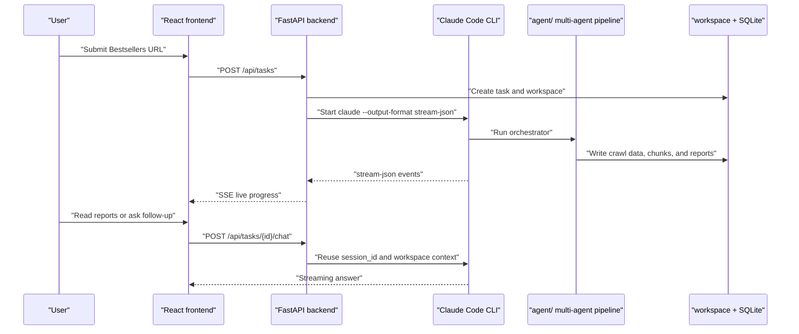

<div align="center">

# Amazon Bestsellers Summary App

*An Agent workspace for Amazon Bestsellers category research: from category URL to market reports, live progress, and follow-up Q&A.*

[](https://code.claude.com/)
[](https://fastapi.tiangolo.com/)
[](https://react.dev/)
[](https://www.docker.com/)
[](LICENSE)

> **Agent Workspace** | **Amazon Bestsellers** | **Realtime SSE** | **Claude Code** | **Apache-2.0**

</div>

---

<div align="center">

**Language / 语言**

[简体中文](README.md) | [**English**](README_en.md)

</div>

---

<div align="center">

[Overview](#overview) · [Capabilities](#capabilities) · [Architecture](#architecture) · [Runtime Flow](#runtime-flow) · [Deployment](#deployment) · [Credits](#credits)

</div>

---

## Overview

**Amazon Bestsellers Summary App** is a web application for Amazon category research. After a user submits a Bestsellers category URL, the backend invokes the Claude Code multi-agent pipeline under `agent/` to crawl category data, fetch product pages, chunk product content, audit completeness, run four analysis dimensions, and generate a final summary report.

The app layer provides a durable task workspace: authentication, task history, live execution streams, report reading, follow-up Q&A on completed tasks, model configuration, encrypted API key storage, and Credits usage tracking. It turns the command-line Agent pipeline into a reusable product interface.

## Capabilities

| Capability | Description |
|---|---|
| Category analysis tasks | Create an analysis task from an Amazon Bestsellers category URL and resolve the Browse Node ID |
| Live progress | Display Claude Code stream-json events, tool calls, system logs, and execution phases through SSE |
| Report reading | Read summary, marketplace, reviews, A+ content, and fine-grained Markdown reports in the UI |
| Follow-up Q&A | Ask follow-up questions on completed tasks with task workspace and Claude Code session reuse |
| Refresh and rerun | Refresh ranking data, resume from checkpoints, run a full reanalysis, cancel, or delete tasks |
| Authentication | Email-code signup and login, with Google and GitHub OAuth configuration support |
| Model configuration | Maintain multiple model profiles, switch defaults, and store API keys encrypted |
| Credits tracking | Extract token and cost usage from Claude Code result events and persist them in SQLite |
| History restore | Persist stream items and chat messages so context survives task switching and service restarts |

## Architecture

```text
amazon-bestsellers/
├── agent/                  Claude Code multi-agent analysis pipeline
│   ├── agents/             orchestrator, chunker, audit, and four analysts
│   ├── skills/             chunking, extraction, and four-dimensional analysis skills
│   ├── scraper/            MCP Server and Amazon crawlers
│   └── chunker/            static chunker and HTML chunking logic
├── backend/                FastAPI backend
│   ├── main.py             API, task scheduling, auth, Claude Code process management
│   ├── streaming.py        stream-json parsing and history persistence
│   ├── Dockerfile          production image with Claude Code CLI
│   ├── requirements.txt    Python dependencies
│   └── tests/              backend API and stream history tests
├── frontend/               React + Vite frontend
│   ├── src/App.tsx         main workspace UI
│   ├── src/api.ts          API, SSE, and chat stream client
│   ├── src/components/     auth, sidebar, report, stage rail, and live stream components
│   └── tests/              frontend timeline ordering tests
├── scripts/                local troubleshooting scripts
├── docker-compose.yml      frontend and backend container orchestration
├── .env.example            environment variable template
├── LICENSE                 Apache License 2.0
└── ToDo.md                 cross-session task log
```

| Layer | Responsibility |
|---|---|
| Frontend | Authentication, task list, task details, report reading, model settings, and Credits views |
| Backend | Users, tasks, SQLite, SSE, Claude Code subprocesses, and report downloads |
| Agent | Amazon category crawling, product parsing, chunk auditing, and four-dimensional analysis |
| Workspace | HTML, images, chunks, reports, session metadata, and ranking history |

## Runtime Flow



## Deployment

### Docker Compose

Copy `.env.example` to `.env`, then set `JWT_SECRET_KEY` and `CREDITS_ENCRYPTION_KEY` for production. Configure Google and GitHub client credentials only when OAuth login is needed.

```bash
docker-compose up -d --build
```

| Service | URL |
|---|---|
| Frontend | `http://localhost` |
| Backend API | `http://localhost:8000` |
| API docs | `http://localhost:8000/docs` |
| Health check | `http://localhost:8000/api/health` |

Docker uses named volumes for runtime data:

| Volume | Container path | Content |
|---|---|---|
| `backend-data` | `/app/workspace` | analysis outputs, HTML, images, and reports |
| `backend-db` | `/app/data` | SQLite database |

### Local Development

Backend:

```bat
cd backend
pip install -r requirements.txt
uvicorn main:app --host 0.0.0.0 --port 8000 --reload
```

Frontend:

```bat
cd frontend
npm install
npm run dev
```

The default frontend URL is `http://localhost:5173`, and the backend URL is `http://localhost:8000`.

### Environment Variables

| Variable | Required | Default | Description |
|---|---|---|---|
| `ENV` | No | `development` | `development` or `production` |
| `JWT_SECRET_KEY` | Yes in production | random in development | JWT signing secret |
| `JWT_SECRET_KEY_PREVIOUS` | No | empty | previous JWT secret during key rotation |
| `CORS_ORIGINS` | No | `http://localhost:5173` | allowed frontend origins, comma-separated |
| `CREDITS_ENCRYPTION_KEY` | Yes in production | random in development | encryption key for model API keys |
| `PORT` | No | `8000` | backend port |
| `DB_PATH` | No | `backend/conversations.db` | SQLite database path |
| `WORKSPACE_BASE` | No | `backend/workspace` | analysis workspace path |
| `GOOGLE_OAUTH_CLIENT_ID` | No | empty | Google OAuth client id |
| `GOOGLE_OAUTH_CLIENT_SECRET` | No | empty | Google OAuth client secret |
| `GITHUB_OAUTH_CLIENT_ID` | No | empty | GitHub OAuth client id |
| `GITHUB_OAUTH_CLIENT_SECRET` | No | empty | GitHub OAuth client secret |
| `OAUTH_REDIRECT_BASE_URL` | No | empty | public frontend base URL for OAuth callbacks |

## Testing

| Scope | Command |
|---|---|
| Backend tests | `cd backend && pytest` |
| Frontend build | `cd frontend && npm run build` |
| Frontend lint | `cd frontend && npm run lint` |

Local Playwright screenshots and test artifacts are written to `.playwright-*` or `test-results/`, which are ignored by Git.

## Persistence

| Data | Default path | Description |
|---|---|---|
| SQLite | `backend/conversations.db` | users, tasks, sessions, stream items, chat messages, model configs, and Credits |
| Workspace | `backend/workspace` | crawl data, product HTML, images, chunks, reports, and analysis metadata |
| Docker SQLite | `/app/data/conversations.db` | persisted through the `backend-db` volume |
| Docker Workspace | `/app/workspace` | persisted through the `backend-data` volume |

`.env`, SQLite databases, workspace files, logs, and test artifacts are local runtime data and should not be committed.

## Relationship With the Agent Project

The root App owns the product experience and server-side orchestration. `agent/` owns the actual Amazon analysis capability. The backend starts Claude Code CLI and passes the task workspace, Browse Node ID, URL, and model configuration to the agent orchestrator. Reports produced by the agent are then displayed by the frontend.

| Module | Scope | Description |
|---|---|---|
| `agent/README.md` | Agent plugin docs | For Claude Code plugin and command-line usage |
| `README.md` | App product docs | For Web App deployment, development, and usage |
| `backend/` | App backend | Schedules Claude Code and persists task state |
| `frontend/` | App frontend | Provides the Agent workspace UI |

## License

This project is licensed under the [Apache License 2.0](LICENSE).

## Credits

| Project | Notes |
|---|---|
| [Claude Code](https://code.claude.com/) | Thanks to Claude Code for the orchestratable and stream-observable Agent runtime |
| [amazon-bestsellers-summary-agent](https://github.com/anthropics/amazon-bestsellers-summary-agent) | Original reference project for the Amazon Bestsellers multi-dimensional analysis pipeline |
| [FastAPI](https://fastapi.tiangolo.com/) | Backend API, SSE, and service orchestration foundation |
| [React](https://react.dev/) | Frontend workspace UI foundation |
| [Vite](https://vite.dev/) | Frontend development and build tooling |
